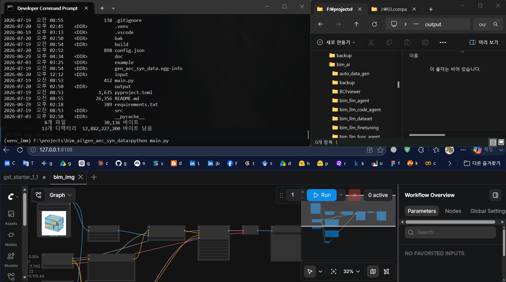
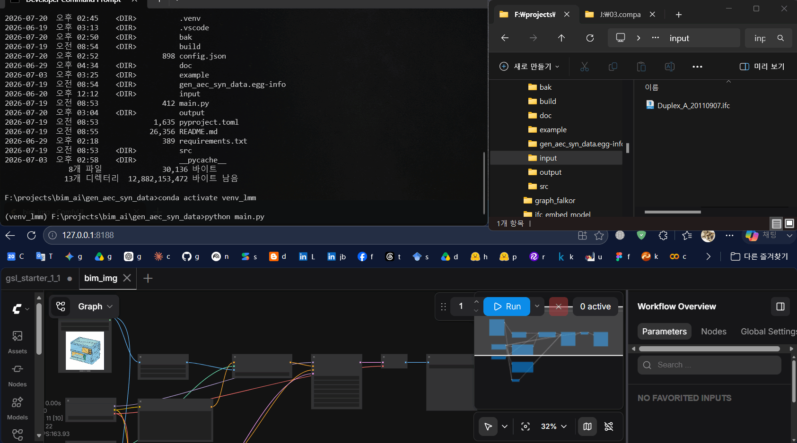
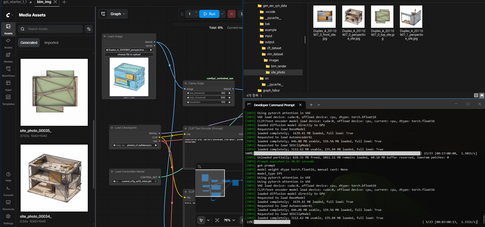
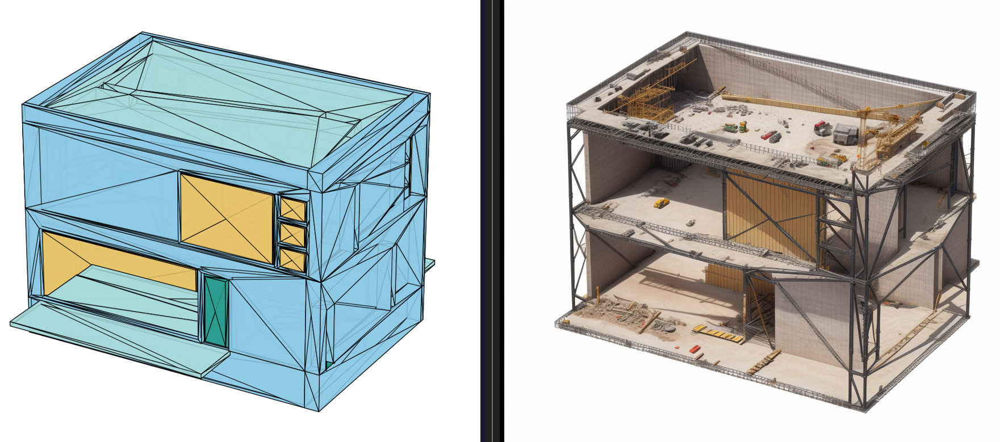
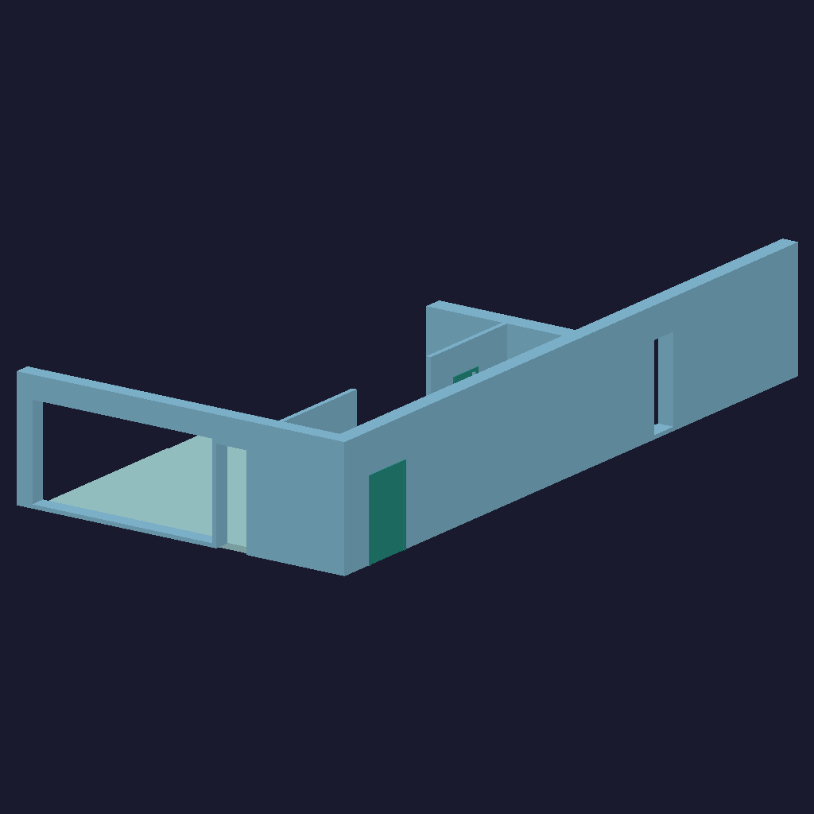
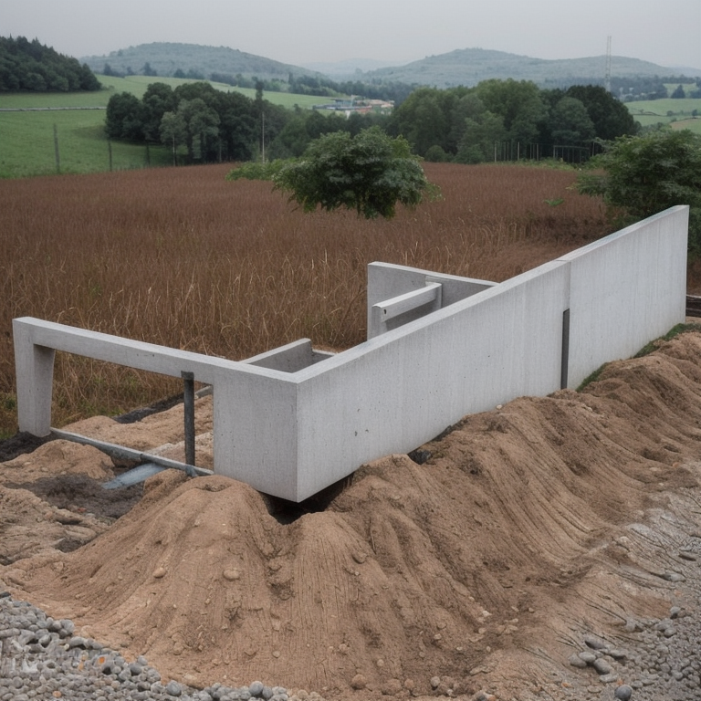
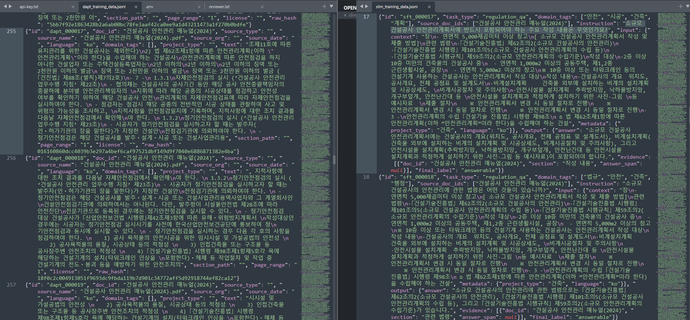

# AEC Synthetic Dataset Generation Pipeline

The pipeline that ingests AEC source documents and 3D BIM models (IFC) to automatically generate high-quality, AI-ready synthetic datasets (JSONL + Images) for sLLM and VLM training.

<p align="center">
  </img></br>
  </img></br>
  </img></br>
  </img></br>
  </img>
  </img></br>  
  </img></br>
</p>
---

## Table of Contents

- [Overview](#overview)
- [Features](#features)
- [Architecture](#architecture)
- [Prerequisites](#prerequisites)
  - [1. Ollama (Local LLM)](#1-ollama-local-llm)
  - [2. llama-server (Fast Local LLM — Recommended)](#2-llama-server-fast-local-llm--recommended)
  - [3. Google Gemini API (Optional Cloud Backend)](#3-google-gemini-api-optional-cloud-backend)
  - [4. ComfyUI (Image Synthesis)](#4-comfyui-image-synthesis)
  - [5. Python Environment](#5-python-environment)
- [Installation](#installation)
- [Usage](#usage)
- [Output Schema](#output-schema)
- [Configuration](#configuration)
- [Depth-conditioned site-photo synthesis](#depth-conditioned-site-photo-synthesis)
- [Revision History](#revision-history)
- [License](#license)
- [Developer](#developer)

---

## Overview

Modern AEC (Architecture, Engineering, Construction) AI models require large volumes of domain-specific training data — construction regulation QA pairs, BIM-to-site photo alignments, and structural element annotations. Collecting and labelling this data manually is prohibitively expensive.

This pipeline automates the full synthesis loop:

```
                                 ┌─ SFT  ─► QA pairs   (LLM)    ─► output/<pdf>_sft/sllm_training_data.jsonl
PDF Documents  ──►  Text Chunks ─┤
                                 └─ DAPT ─► raw corpus (no LLM) ─► output/<pdf>_dapt/dapt_training_data.jsonl
IFC 3D Models  ──►  BIM Renders + Depth Maps ──► ComfyUI ControlNet ─► output/<ifc>_vlm/vlm_training_data.jsonl + Images
```

Each input file gets its own output folder named `<input-file-stem>_<sft|dapt|vlm>` under `output/`.

Local inference runs on a single machine. The sLLM branch scales with whatever
the host can hold — an 8 GB VRAM GPU runs a 7B model, while a large-unified-memory
host such as an NVIDIA DGX Spark (GB10, 128 GB) runs a 30B MoE model like
`qwen3:30b-a3b`. The VLM branch needs ~4 GB for SD 1.5 + ControlNet.
Three LLM backends are supported for SFT synthesis:

- **Ollama** — easiest local setup
- **llama-server** — faster local inference (grammar-enforced JSON, parallel slots)
- **Gemini** — optional Google cloud API (JSON-enforced output); API key supplied via `.env`

Two sLLM dataset modes are produced from PDFs (selected with `--dataset`):

- **SFT** — instruction/QA pairs generated by an LLM backend
- **DAPT** — raw domain corpus for continued pre-training (deterministic, **no LLM required**)

All settings have defaults in **`config.json`**, overridable per run by CLI flags or a full `--config` file.

---

## Features

| Feature                      | Detail                                                                                        |
| ---------------------------- | --------------------------------------------------------------------------------------------- |
| **PDF Extraction**     | PyMuPDF paragraph-aware chunking + text normalisation (vertical-type folding, TOC/page-furniture removal) |
| **SFT / DAPT Modes**   | `--dataset sft\|dapt\|both` — QA pairs (LLM) and/or raw domain corpus                        |
| **sLLM Synthesis**     | Ollama, llama-server, or Gemini backend — multi-QA per chunk, explicit context/output limits  |
| **Multi-QA per Chunk** | Single LLM call generates N QA pairs from one chunk (`--qa-per-chunk N`)                    |
| **DAPT Enrichment**    | Document metadata (`source_type`, `source_org`, `source_date`, `project_type`, `domain_tags`) inferred once per document; `section_path` tracked; duplicates dropped by `raw_hash` |
| **IFC Parsing**        | IfcOpenShell element metadata extraction + multi-view 3D renders                              |
| **Shared Rasteriser**  | BIM render and ControlNet depth map come from one z-buffer pass — pixel-identical silhouettes |
| **VLM Synthesis**      | ComfyUI headless API — depth ControlNet + photoreal SD 1.5, generated from an empty latent   |
| **Schema Compliance**  | Pydantic-validated JSONL (Tulu-3 SFT + MMFineReason-SFT compatible)                           |
| **Config & Secrets**   | `config.json` defaults + `--config`/`--save-config`; API keys loaded from `.env`        |
| **Graceful Fallback**  | Pipeline continues even when a backend or ComfyUI is unreachable                              |
| **CLI**                | Full`argparse` CLI with per-file targeting, dry-run, and config save/load                   |
| **Local-first**        | Ollama / llama-server keep all data on-machine; Gemini backend is opt-in cloud               |

---

## Architecture

```
gen_aec_syn_data/
├── main.py                  # CLI entry point
├── config.json             # Default settings (loaded at startup)
├── .env                     # Secrets (e.g. GEMINI_API_KEY) — git-ignored
├── .env.example             # Template for .env
├── requirements.txt
├── input/                   # Drop PDF / IFC files here
├── output/                  # Auto-created; one sub-folder per input file
│   ├── <pdf-stem>_sft/
│   │   └── sllm_training_data.jsonl   # SFT (QA pairs)
│   ├── <pdf-stem>_dapt/
│   │   └── dapt_training_data.jsonl   # DAPT (raw corpus)
│   └── <ifc-stem>_vlm/
│       ├── vlm_training_data.jsonl
│       └── images/
│           ├── bim_render/          # colour render
│           ├── depth/               # ControlNet depth hint
│           └── site_photo/          # synthesised photograph
└── src/
    ├── config.py            # PipelineConfig dataclass + config.json loader
    ├── schemas.py           # Pydantic schemas — SFTSample, DAPTSample, VLMSample
    ├── pdf_extractor.py     # PyMuPDF chunker
    ├── ifc_processor.py     # IfcOpenShell + z-buffer renderer / depth rasteriser
    ├── sllm_sft_engine.py   # SFT synthesis — Ollama / llama-server / Gemini
    ├── sllm_dapt_engine.py  # DAPT corpus builder + document metadata inference
    ├── vlm_engine.py        # ComfyUI REST API client
    └── pipeline.py          # Top-level orchestrator
```

---

## Prerequisites

### 1. Ollama (Local LLM)

Ollama serves the language model that generates sLLM QA pairs locally.

**Install Ollama**

```bash
# Windows — download and run the installer from:
https://ollama.com/download/windows

# macOS
brew install ollama

# Linux
curl -fsSL https://ollama.com/install.sh | sh
```

**Start the Ollama server**

```bash
ollama serve
# Ollama listens on http://localhost:11434 by default
```

**Pull a model**

```bash
# Default in config.json — MoE, 30B total but only 3B active per token, so it
# runs at roughly 7B speed while holding 30B-class quality. ~18 GB.
ollama pull qwen3:30b-a3b

# Smaller hosts (8 GB VRAM class)
ollama pull llama3:8b-instruct-q4_K_M
```

> On memory-bandwidth-bound hardware (unified-memory hosts such as DGX Spark),
> prefer a **MoE** model: decode speed tracks the *active* parameter count, not
> the total. A dense 70B fits in 128 GB but decodes several times slower than a
> 30B MoE with 3B active.
>
> Other compatible models: `gpt-oss:20b`, `qwen3-coder:30b`,
> `mistral:7b-instruct-q4_K_M`.
>
> **Reasoning models** (qwen3, gpt-oss): leave `ollama_json_mode` at `false`.
> See [Ollama generation limits](#ollama-generation-limits).

Verify the server is running:

```bash
curl http://localhost:11434/api/tags
```

---

### 2. llama-server (Fast Local LLM — Recommended)

llama-server is the HTTP inference server bundled with [llama.cpp](https://github.com/ggerganov/llama.cpp). Compared to Ollama it offers:

- **Grammar-enforced JSON** (`response_format: json_object`) — eliminates retry waste
- **Parallel slots** (`--parallel N`) — processes multiple chunks concurrently
- **No model reload overhead** — model stays in VRAM for the lifetime of the process

> If you prefer to stay with Ollama, skip this section. Both backends are supported via `--backend ollama|llamaserver`.

#### Step 1 — Download llama-server binary (Windows, CUDA)

Go to the [llama.cpp Releases page](https://github.com/ggerganov/llama.cpp/releases/latest) and download the file matching your CUDA version:

```
llama-bXXXX-bin-win-cuda-cu12.X.X-x64.zip
```

Extract to a permanent directory, e.g. `C:\llama-server\`.

#### Step 2 — Download the Qwen2.5 GGUF model

[Qwen2.5-7B-Instruct](https://huggingface.co/Qwen/Qwen2.5-7B-Instruct) is recommended for 8 GB VRAM.
Pre-quantised GGUF files are published by the community on HuggingFace:

```powershell
pip install huggingface_hub

python -c "
from huggingface_hub import hf_hub_download
# Q4_K_M — best quality/speed trade-off, ~4.7 GB
hf_hub_download(
    repo_id='bartowski/Qwen2.5-7B-Instruct-GGUF',
    filename='Qwen2.5-7B-Instruct-Q4_K_M.gguf',
    local_dir='C:/llama-server/models'
)
print('Download complete.')
"
```

For 10–12 GB VRAM, use the 14B model instead:

```powershell
python -c "
from huggingface_hub import hf_hub_download
hf_hub_download(
    repo_id='bartowski/Qwen2.5-14B-Instruct-GGUF',
    filename='Qwen2.5-14B-Instruct-Q4_K_M.gguf',
    local_dir='C:/llama-server/models'
)
"
```

| Model                    | VRAM (Q4_K_M) | Tokens/sec (RTX 3080) | Korean quality |
| ------------------------ | ------------- | --------------------- | -------------- |
| Qwen2.5-7B-Instruct      | ~5 GB         | ~45 tok/s             | ★★★★       |
| Qwen2.5-14B-Instruct     | ~9 GB         | ~25 tok/s             | ★★★★★     |

#### Step 3 — Start llama-server

```powershell
cd C:\llama-server

# 8 GB VRAM — 7B model, 4 parallel inference slots
.\llama-server.exe `
  --model models\Qwen2.5-7B-Instruct-Q4_K_M.gguf `
  --n-gpu-layers 35 `
  --parallel 4 `
  --ctx-size 4096 `
  --port 8080

# Server is ready when you see:
# llama server listening at http://127.0.0.1:8080
```

Verify:

```powershell
curl http://localhost:8080/health
# {"status":"ok"}
```

---

### 3. Google Gemini API (Optional Cloud Backend)

Gemini is an **optional** backend for SFT synthesis when you prefer a hosted model over local Ollama / llama-server. It returns JSON-enforced output (`response_mime_type="application/json"`) and requires no GPU.

> Skip this section if you only use local backends. Note: with Gemini, document chunks are sent to Google's API — it is **not** a 100%-local path.

**Install the SDK**

```bash
pip install google-genai
```

**Provide the API key via `.env`** (recommended — keeps the key out of source and shell history)

```bash
# Copy the template, then edit .env and paste your key
cp .env.example .env
```

```dotenv
# .env
GEMINI_API_KEY=your_api_key_here
```

`main.py` loads `.env` automatically at startup (via `python-dotenv`). Alternatively pass `--gemini-api-key` or export `GEMINI_API_KEY` in your shell. `.env` is git-ignored and must never be committed.

**Run with the Gemini backend**

```bash
python main.py --backend gemini --gemini-model gemini-2.5-flash --pdf input/regulation.pdf
```

---

### 4. ComfyUI (Image Synthesis)

ComfyUI drives the depth-ControlNet pipeline that turns BIM geometry into synthetic site photographs.

**Clone and set up ComfyUI**

```bash
git clone https://github.com/comfyanonymous/ComfyUI.git
cd ComfyUI
pip install -r requirements.txt
```

**Download required model weights**

The VLM branch conditions a **depth** ControlNet with a depth map rasterised
from the IFC mesh (see [Depth-conditioned site-photo synthesis](#depth-conditioned-site-photo-synthesis)),
so a depth ControlNet is required — a Canny or MLSD model conditions on a
signal this pipeline does not produce.

| File                                            | Destination                     | Size   |
| ----------------------------------------------- | ------------------------------- | ------ |
| `Realistic_Vision_V6.0_NV_B1_fp16.safetensors` | `ComfyUI/models/checkpoints/` | 2.1 GB |
| `control_v11f1p_sd15_depth.pth`                | `ComfyUI/models/controlnet/`  | 1.4 GB |

```bash
# Photoreal SD 1.5 checkpoint — base SD 1.5 renders architecture flatly and
# does not produce a convincing photograph
cd ComfyUI/models/checkpoints
curl -LO https://huggingface.co/SG161222/Realistic_Vision_V6.0_B1_noVAE/resolve/main/Realistic_Vision_V6.0_NV_B1_fp16.safetensors

# Depth ControlNet
cd ../controlnet
curl -LO https://huggingface.co/lllyasviel/ControlNet-v1-1/resolve/main/control_v11f1p_sd15_depth.pth
```

Model pages:

| Model                                   | Role                            | Link                                                                                                                  |
| --------------------------------------- | ------------------------------- | --------------------------------------------------------------------------------------------------------------------- |
| Realistic Vision V6.0 B1                | SD 1.5 photoreal checkpoint     | [SG161222/Realistic_Vision_V6.0_B1_noVAE](https://huggingface.co/SG161222/Realistic_Vision_V6.0_B1_noVAE)                 |
| ControlNet v1.1 depth                   | Holds the BIM form              | [lllyasviel/ControlNet-v1-1](https://huggingface.co/lllyasviel/ControlNet-v1-1)                                           |
| Stable Diffusion 1.5 (base, *optional*) | Fallback checkpoint             | [stable-diffusion-v1-5](https://huggingface.co/stable-diffusion-v1-5/stable-diffusion-v1-5)                               |

Names are resolved at run time: if the checkpoint or ControlNet named in
`config.json` is absent, the engine auto-selects an installed model whose
name matches `vlm_control_hint` and logs a warning.

> No custom ComfyUI nodes are required. The workflow uses only core nodes
> (`ControlNetApplyAdvanced`, `EmptyLatentImage`, `KSampler`), because the
> depth hint is rasterised in this project rather than by a preprocessor node.

**Start ComfyUI in headless API mode**

```bash
cd ComfyUI
python main.py --listen 127.0.0.1 --port 8188
```

Verify the API is up:

```bash
curl http://127.0.0.1:8188/system_stats
```

> **Note:** ComfyUI is optional. If it is not reachable, the pipeline falls back to using the BIM render directly as the site-photo placeholder so that structurally valid VLM JSONL records are still produced.

---

### 5. Python Environment

- Python **3.10** or newer
- CUDA-capable GPU with **≥ 8 GB VRAM** (for ComfyUI)
- CPU-only mode is supported for PDF/sLLM processing (and for the DAPT mode, which needs no GPU at all)

---

## Installation

```bash
# 1. Clone the repository
git clone <repo-url>
cd gen_aec_syn_data

# 2. Create and activate a virtual environment (recommended)
python -m venv .venv

# Windows
.venv\Scripts\activate
# macOS / Linux
source .venv/bin/activate

# 3. Install Python dependencies
pip install -r requirements.txt

# 4. (Optional) Configure secrets for the Gemini backend
cp .env.example .env      # then edit .env and set GEMINI_API_KEY
```

> Default settings live in `config.json` and are loaded automatically on every run.
> Edit that file to change pipeline-wide defaults, or override any value per run with the CLI flags below.

---

## Usage

### Quick start

```bash
# Place input files in ./input/
# Then run the full pipeline
python main.py
```

### Process specific files

```bash
python main.py --pdf input/building_code.pdf --ifc input/office_tower.ifc
```

### sLLM only (PDF → JSONL)

```bash
python main.py --pdf input/regulation.pdf
```

### VLM only (IFC → JSONL + Images)

```bash
python main.py --ifc input/bridge.ifc
```

### Dry-run (discover files, print config, no LLM calls)

```bash
python main.py --dry-run
```

### Override model and output directory

```bash
python main.py \
  --model mistral:7b-instruct-q4_K_M \
  --output-dir /data/aec_training
```

### Choose the sLLM dataset mode (SFT / DAPT / both)

```bash
# SFT — instruction/QA pairs (needs an LLM backend)
python main.py --dataset sft --pdf input/regulation.pdf

# DAPT — raw domain corpus for continued pre-training (no LLM; --backend none is fine)
python main.py --dataset dapt --backend none --pdf input/regulation.pdf

# Both in a single pass
python main.py --dataset both --pdf input/regulation.pdf
```

> For a PDF named `regulation.pdf`, SFT records are written to
> `output/regulation_sft/sllm_training_data.jsonl` and DAPT records to
> `output/regulation_dapt/dapt_training_data.jsonl`.

### Gemini backend (cloud)

```bash
# Reads GEMINI_API_KEY from .env (see Prerequisites §3)
python main.py --backend gemini --gemini-model gemini-2.5-flash --pdf input/regulation.pdf
```

### llama-server backend — Qwen2.5 with parallel workers

First start llama-server (see [Prerequisites §2](#2-llama-server-fast-local-llm--recommended)), then:

```powershell
# 4 parallel workers, 3 QA pairs per chunk → ~50× faster than default Ollama
python main.py `
  --backend llamaserver `
  --llama-server-url http://localhost:8080 `
  --parallel 4 `
  --qa-per-chunk 3 `
  --pdf input/regulation.pdf
```

### Multi-QA per chunk (Ollama, no hardware change required)

```bash
# 3 QA pairs per chunk, sequential — reduces total LLM calls by 3×
python main.py --qa-per-chunk 3 --pdf input/regulation.pdf
```

### Tune Ollama for fewer reloads

```powershell
# Keep model in VRAM indefinitely + allow 4 parallel requests
$env:OLLAMA_KEEP_ALIVE = "-1"
$env:OLLAMA_NUM_PARALLEL = "4"
ollama serve
```

### Defaults and configuration files

Settings are resolved in this order (later overrides earlier):

1. Built-in dataclass defaults (`src/config.py`)
2. **`config.json`** in the project root (loaded automatically if present)
3. CLI flags for the current run
4. `--config <file>` — when given, loads that JSON directly (takes precedence)

```bash
# Edit project-wide defaults
#   → just edit config.json with any text editor

# Save the fully resolved settings of a run to a JSON file
python main.py --save-config config.json

# Reuse a saved configuration
python main.py --config config.json
```

### All CLI options

> Default values shown in brackets come from `config.json`; change them there to set new project-wide defaults.

```
usage: aec-pipeline [-h] [--input-dir DIR] [--output-dir DIR]
                    [--pdf PDF_PATH] [--ifc IFC_PATH]
                    [--dataset {sft,dapt,both}]
                    [--backend {ollama,llamaserver,gemini,none}]
                    [--parallel N] [--qa-per-chunk N]
                    [--model MODEL] [--ollama-url URL]
                    [--llama-server-url URL]
                    [--gemini-api-key KEY] [--gemini-model MODEL]
                    [--temperature T] [--max-samples N]
                    [--chunk-min N] [--chunk-max N] [--chunk-overlap N]
                    [--comfyui-url URL]
                    [--ifc-views {perspective,top,front,side} ...]
                    [--render-size N]
                    [--config JSON] [--save-config JSON]
                    [--dry-run] [--verbose]

Options:
  --input-dir DIR              Directory to scan for PDF/IFC files
  --output-dir DIR             Root directory for generated outputs
  --pdf PDF_PATH               Explicit PDF file(s) to process (repeatable)
  --ifc IFC_PATH               Explicit IFC file(s) to process (repeatable)

  --dataset {sft,dapt,both}    sLLM dataset(s) to generate from PDFs  [sft]
  --backend {ollama,llamaserver,gemini,none}
                               LLM backend for SFT synthesis  [gemini]
  --parallel N                 Concurrent worker threads
  --qa-per-chunk N             QA pairs per chunk per LLM call

  --model MODEL                Ollama model name
  --ollama-url URL             Ollama base URL
  --llama-server-url URL       llama-server base URL
  --gemini-api-key KEY         Gemini API key (falls back to GEMINI_API_KEY / .env)
  --gemini-model MODEL         Gemini model name  [gemini-2.5-flash]
  --temperature T              LLM sampling temperature
  --max-samples N              Max sLLM samples per document
  --chunk-min N                Min chunk size in characters
  --chunk-max N                Max chunk size in characters
  --chunk-overlap N            Chunk overlap in characters
  --comfyui-url URL            ComfyUI API base URL
  --ifc-views [...]            IFC views to render
  --render-size N              Render resolution in pixels (square)
  --config JSON                Load settings from a JSON config file (overrides config.json)
  --save-config JSON           Save resolved settings to JSON and exit
  --dry-run                    Discover files only; skip all inference
  --verbose                    Enable DEBUG-level logging
```

---

## Output Schema

### sLLM DAPT — `output/<pdf-stem>_dapt/dapt_training_data.jsonl`

One JSON object per line — raw domain text for continued pre-training (no LLM, no QA):

```json
{
  "id": "dapt_000001",
  "doc_id": "doc_001",
  "source_type": "",
  "source_name": "regulation.pdf",
  "language": "ko",
  "domain_tags": [],
  "text": "<verbatim document chunk>",
  "section_path": "",
  "page_range": "12-13",
  "license": "",
  "raw_hash": "<sha256 of text, for dedup>"
}
```

### sLLM SFT — `output/<pdf-stem>_sft/sllm_training_data.jsonl`

One JSON object per line (instruction + grounded answer with evidence tracing):

```json
{
  "id": "sft_000001",
  "task_type": "regulation_qa",
  "domain_tags": ["구조", "안전"],
  "source_doc_ids": ["doc_001"],
  "instruction": "<question from document chunk>",
  "input": {
    "context": "<relevant clause text>",
    "metadata": { "project_type": "건축", "language": "ko" }
  },
  "output": {
    "answer": "<grounded answer>",
    "evidence": [
      { "doc_id": "doc_001", "section": "제3조 2항" }
    ],
    "final_label": "answerable"
  }
}
```

### VLM — `output/<ifc-stem>_vlm/vlm_training_data.jsonl`

One JSON object per line (MMFineReason-SFT compatible). Image paths are
relative to the file's own `_vlm` folder:

```json
{
  "id": "vlm_000001",
  "task_type": "bim_site_alignment",
  "images": [
    "images/bim_render/model_perspective.png",
    "images/site_photo/model_perspective_site.jpg"
  ],
  "metadata": {
    "project_type": "교량",
    "bim_element_ids": ["elem_128", "elem_129"],
    "trade_type": "철근콘크리트",
    "view_type": "3d_perspective"
  },
  "instruction": "현장 사진이 BIM 설계 상태와 일치하는지 판단하고 근거를 설명하라.",
  "output": {
    "answer": "<alignment analysis>",
    "label": "partial_match",
    "evidence": ["<evidence sentence 1>", "..."]
  }
}
```

---

## Configuration

All settings are exposed as a `PipelineConfig` dataclass (`src/config.py`).

- **`config.json`** (project root) holds the default value of every parameter and is loaded automatically at startup. Edit it to change project-wide defaults — no code change needed.
- Any value can be overridden per run with a CLI flag, or replaced wholesale with `--config <file>`.
- `--save-config <file>` writes the fully resolved settings (defaults + overrides) back to a JSON file.
- **Secrets** (e.g. `gemini_api_key`) are kept out of `config.json` and loaded from `.env` instead — keep `config.json`'s `gemini_api_key` empty.

Key parameters:

| Parameter                   | Default                        | Description                                                       |
| --------------------------- | ------------------------------ | ----------------------------------------------------------------- |
| `dataset_mode`            | `both`                       | `"sft"`, `"dapt"`, or `"both"` (selected by `--dataset`)    |
| `llm_backend`             | `ollama`                     | `"ollama"`, `"llamaserver"`, `"gemini"`, or `"none"`       |
| `gemini_model`            | `gemini-2.5-flash`           | Gemini model name (used when `llm_backend="gemini"`)            |
| `llm_parallel`            | `1`                          | Concurrent worker threads (match`--parallel N` of llama-server) |
| `qa_per_chunk`            | `3`                          | QA pairs generated per chunk in a single LLM call                 |
| `ollama_model`            | `qwen3:30b-a3b`              | Ollama model tag                                                  |
| `llama_server_url`        | `http://localhost:8080`      | llama-server base URL                                             |
| `ollama_temperature`      | `0.1`                        | Lower = more deterministic output                                 |
| `chunk_min_size`          | `500`                        | Minimum characters per text chunk                                 |
| `chunk_max_size`          | `700`                        | Maximum characters per text chunk                                 |
| `chunk_overlap`           | `200`                        | Character overlap between consecutive chunks                      |
| `max_samples_per_doc`     | `50`                         | Cap on sLLM samples generated per PDF                             |
| `llm_max_retries`         | `3`                          | Retry attempts on malformed LLM output                            |
| `ifc_views`               | `[perspective, top, front]`  | Camera angles for BIM renders                                     |
| `ifc_render_width/height` | `1024`                       | Render resolution                                                 |
| `ifc_max_elements`        | `500`                        | Element count cap for rendering performance                       |
| `comfyui_url`             | `http://127.0.0.1:8188`      | ComfyUI headless API endpoint                                     |

### Ollama generation limits

Set explicitly so behaviour does not depend on a hand-written Modelfile.

| Parameter              | Default | Description                                                                                                                            |
| ---------------------- | ------- | -------------------------------------------------------------------------------------------------------------------------------------- |
| `ollama_num_ctx`     | `16384` | Context window. Ollama otherwise opens the model at its full trained context (262 144 for qwen3), reserving tens of GB of KV cache.     |
| `ollama_num_predict` | `8192`  | Output cap. The multi-QA prompt's nested schema runs to ~5 000 tokens; a lower cap truncates mid-JSON and the reply cannot be parsed.   |
| `ollama_json_mode`   | `false` | Grammar-enforced JSON. **Leave off for reasoning models** — on qwen3 the grammar binds the answer channel while tokens go to the thinking channel, and the reply comes back empty. Enable only for a model you have verified. |

### DAPT corpus

| Parameter                | Default | Description                                                                                                    |
| ------------------------ | ------- | -------------------------------------------------------------------------------------------------------------- |
| `dapt_infer_metadata`  | `true`  | One Ollama call per document fills `source_type`, `source_org`, `source_date`, `project_type`, `domain_tags`, `license`. Fields are left empty on failure rather than guessed. |
| `dapt_dedupe`          | `true`  | Drop repeated chunks by `raw_hash` (repeated notices, running headers)                                        |

### IFC rendering

| Parameter                       | Default                                        | Description                                                                                     |
| ------------------------------- | ---------------------------------------------- | ------------------------------------------------------------------------------------------------- |
| `ifc_view_angles`             | `{"perspective":[18,-55], "top":[90,-90], …}` | `(elev, azim)` per view. The perspective sits low; a steep bird's-eye angle does not read as a site photograph. |
| `ifc_min_elements_per_group`  | `5`                                            | Space groups below this are skipped — a lone wall on empty ground makes a weak training pair. The whole-model group is always kept. |

### VLM image synthesis

| Parameter                     | Default                     | Description                                                                                                              |
| ----------------------------- | --------------------------- | ------------------------------------------------------------------------------------------------------------------------ |
| `sd_base_model`             | `Realistic_Vision_V6.0_NV_B1_fp16.safetensors` | ComfyUI checkpoint                                                                            |
| `controlnet_model`          | `control_v11f1p_sd15_depth.pth` | ComfyUI ControlNet                                                                                         |
| `vlm_control_hint`          | `depth`                   | `"depth"` feeds the rasterised depth map; `"render"` feeds the colour BIM render (legacy, leaks the wireframe look) |
| `vlm_photo_views`           | `["perspective"]`         | Views that get a synthesised photo. An orthographic plan has no photographic equivalent — the sampler stands the slab up and paints it as a facade, which reads as a 90° rotation. |
| `vlm_init_from_render`      | `false`                   | `false` starts from an empty latent. `true` restores img2img from the BIM render (needs `i2i_denoise` < 1) |
| `vlm_depth_ground_plane`    | `true`                    | Fill empty depth pixels with an infinite ground plane, giving the hint a horizon and a receding floor       |
| `vlm_ground_roughness`      | `0.10`                    | Undulation added to that ground, as a fraction of the model's depth range. `0` gives a flat plane, which renders as a paved slab |
| `vlm_control_resolution`    | `512`                     | Depth-map raster size fed to ControlNet                                                                     |
| `vlm_image_width/height`    | `768`                     | Generated image resolution                                                                                  |
| `vlm_sampler` / `vlm_scheduler` | `dpmpp_2m` / `karras` | KSampler settings                                                                                           |
| `vlm_seed`                  | `-1`                      | `-1` derives a stable per-image seed from the file name (reruns reproduce, sibling views differ)           |
| `i2i_denoise`               | `1.0`                     | Denoising strength; `1.0` means the render contributes nothing to the latent                              |
| `i2i_steps` / `i2i_cfg`     | `30` / `7.0`              | Diffusion steps and guidance scale                                                                          |
| `controlnet_strength`       | `0.80`                    | ControlNet conditioning strength                                                                            |
| `controlnet_start_percent` / `controlnet_end_percent` | `0.0` / `0.75` | Sampling window over which the hint applies. Holding it to 100 % keeps surfaces looking like shaded geometry |
| `vlm_positive_prompt`       | see `config.json`         | Supports `{project_type}`, `{trade_type}`, `{view_type}` substitution                                 |
| `vlm_negative_prompt`       | see `config.json`         | Suppresses the CAD look, demolition drift, wire-mesh wallpaper, desert drift, and paved ground             |
| `vlm_trade_prompts`         | `{}`                      | Optional per-`trade_type` fragment appended to the positive prompt                                        |

---

## Depth-conditioned site-photo synthesis

The VLM branch turns a BIM render into a photograph of the same structure. Two
properties have to hold at once: the output must look photographic, and its
geometry must still match the BIM model it is paired with.

**The BIM form is carried by ControlNet, not by img2img.** Starting the sampler
from the BIM render at `denoise` < 1 leaves part of that render's flat shading
in the final latent, and the output comes back as a recoloured wireframe. The
form is instead held by a depth hint while the latent starts empty, so the
prompt decides every surface.

**The depth hint is a real z-buffer, rasterised from the IFC mesh** (`src/ifc_processor.py`).
Feeding the colour render to a depth ControlNet instead makes it read the drawn
*lines* as geometry. The same rasteriser pass produces the colour BIM render,
so the two images describe exactly the same visible surfaces — every face
enclosed by edges in the render is a solid surface in the photograph.

**Empty pixels are filled with an infinite ground plane** at the model base,
which gives the hint a horizon and a receding floor. A finite ground quad
cannot do this under an orthographic camera: its edges stay visible, so it
reads as a plinth and the building becomes a scale model on a table. That
ground is then undulated slightly (`vlm_ground_roughness`), because a
mathematically flat plane is rendered as a cast concrete slab however hard the
negative prompt argues otherwise.

```
IFC mesh ─┬─► z-buffer ─► colour render ──────────────► images/bim_render/
          │      │
          │      └─► depth + ground fill ─────────────► images/depth/
          │                    │
          └────────────────────┴─► ControlNet ─► SD ──► images/site_photo/
                                   (empty latent, denoise 1.0)
```

---

## Revision History

### v0.3 — VLM realism, corpus quality

**VLM image synthesis rewritten.** Site photos were previously recoloured
wireframes rather than photographs.

- Structure moved from img2img to a depth ControlNet; generation starts from an
  empty latent (`vlm_init_from_render`, `i2i_denoise` 0.70 → 1.0)
- Added a z-buffer depth rasteriser with an analytic infinite ground plane and
  ground roughness (`vlm_depth_ground_plane`, `vlm_ground_roughness`)
- BIM render moved off matplotlib onto the same rasteriser — its alpha-blended
  polygons showed back faces, so the render's silhouette disagreed with the
  depth hint. Silhouettes are now pixel-identical.
- Photo synthesis restricted to perspective views (`vlm_photo_views`);
  orthographic plans were being re-read as facades, which looked like a 90°
  rotation
- Checkpoint switched to Realistic Vision V6.0 B1; ControlNet switched to depth
- Switched to `ControlNetApplyAdvanced` with `controlnet_end_percent`
- Prompts moved into `config.json` with `{project_type}`/`{trade_type}`/
  `{view_type}` substitution
- Camera lowered to `elev 18` and exposed as `ifc_view_angles`
- Sparse space groups skipped (`ifc_min_elements_per_group`)
- Fixed: ComfyUI PNG output was being written with a `.jpg` extension

**Corpus quality.**

- PDF text normalisation: vertically-set text (`국\n토\n교\n통\n부`) folded back
  into one line, TOC dot-leaders and page furniture removed, non-informative
  chunks dropped
- DAPT document metadata inferred once per document; `section_path` tracked
  across chunks; duplicates dropped by `raw_hash`
- Ollama `num_ctx` / `num_predict` set explicitly — the defaults opened the
  model at its full 262 144-token context and truncated replies mid-JSON

### v0.2 — Multi-backend sLLM

- llama-server and Gemini backends, parallel workers, multi-QA per chunk
- DAPT dataset mode; per-input-file output folders
- `config.json` defaults with CLI override and `--save-config`

### v0.1 — Initial release

- PyMuPDF chunking, Ollama SFT synthesis, IfcOpenShell parsing, ComfyUI VLM branch

---

## License

MIT License — see [LICENSE](LICENSE) for details.

---

## Developer

Taewook Kang (laputa99999@gmail.com)
